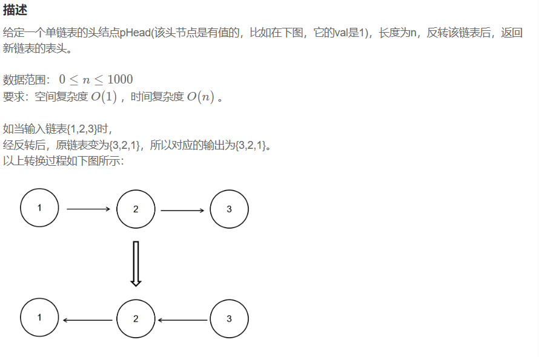
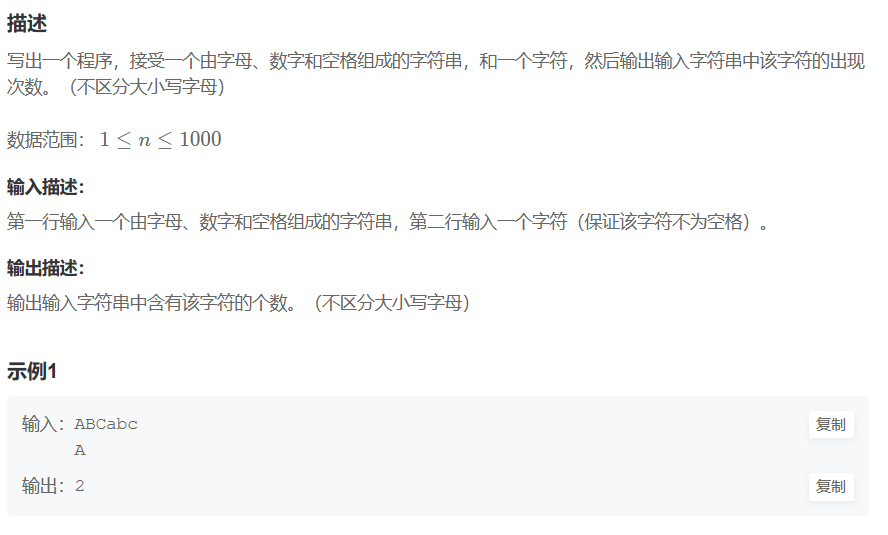
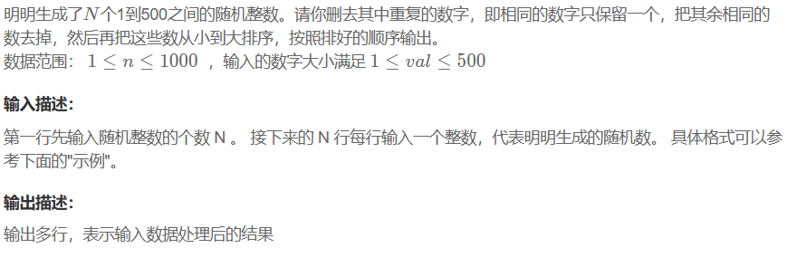
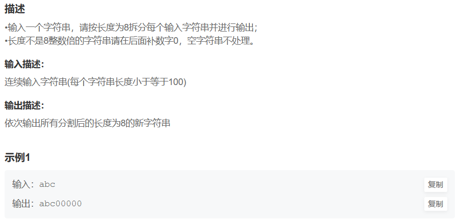

# 算法库 

---------------

## 记录日常算法题源码
1.递归   
2.分治   
3.单调栈  
4.并查集  
5.滑动窗口  
6.前缀和  
7.查分  
8.二分查找   
9.BFS广搜  
10.DFS深搜  

## 题目汇总  

-------------  
 
### 第一部分  
 ###### *1.题目1*  
   
 
### 前情提要  
 ###### *1.标准输入输出第二题*  
   

 ###### *2. 标准输入输出第三题*  
   

 ###### *3. 标准输入输出第四题*
 

 ###### *3. 标准输入输出第五题*
 
 